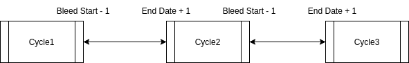
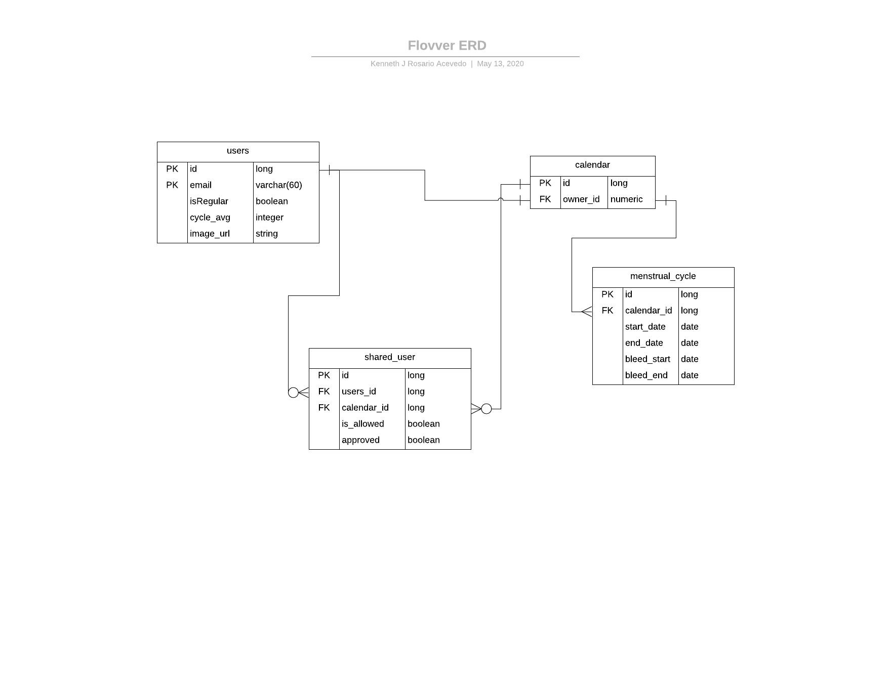

# Domain Description Overview
# For more info view HW 2
## Domain : Menstrual Tracking & Menstrual Communication

## Entities :

* User : A person with interest of tracking its menstrual cycle or viewing a friend's or partner's cycle information
    * Composed of:
        * Calendar
        * Set of Shared Calendars
    * Attributes:
        * Email
        * Is Regular

* Calendar : A structure to keep track of cycles
    * Composed of:
        * Set of Menstrual Cycle
    * Attributes:
        * Owner

* Menstrual Cycle (Atomic) :
    * Attributes:
        * Bleed Start
        * Bleed End
        * End Cycle Date

* Menstrual Cycle Structure:

* Entity RelationShips:

## Functions:

### Single User functions

* Contact another user through email
    * Name: SEARCH_USER
    * PARAMETERS: User U
    * Returns: User U

### Share Calendar with other people functions

* Get People that can see your calendar 
    * Name: GET_SHARED_USERS
    * PARAMETERS: User U
    * Returns: Set of Users U

* Get People that you can see there calendar:
    * Name: GET_SHARED_WITH_ME 
    * PARAMETERS: User U
    * Returns: Set of Users U

* Approve another Person's request to show you his calendar
    * Name: APPROVE
    * PARAMETERs: User U1, User U2

* Get Unapproved message:
    * Name: GET_UNAPPROVED
    * PARAMETERS: User U1,
    * Returns : Set of Users U

* View other persons menstrual information:
    * Name: GET_CYCLE_INFO
    * PARAMETERS: User U1, User U2
    * Returns: Set of MenstrualCycles M

* Show your calendar to another person
    * Name: SHARE_CALENDAR
    * Parameters: User U1, User U2
    * Returns: Set of users U

* Stop Sharing you calendar to another person
    * Name: STOP_SHARING
    * Parameters: U1, U2
    * Returns: void

* Stop viewing another calendar from another user:
    * Name: STOP_SHARING_WITH_ME
    * Parameters: U1
    * Returns: void

    
### Menstual information functions:

* Adds a new period cycle to a calendar
    * Name: ADD_PERIOD
    * Parameters: MenstrualCycle MC1, MenstrualCycle MC2, User U, cal, Date new_bleed_start
    * Description: 
        * Change MC2.bleed_start to new_bleed_start 
        * Change MC1.end_date to MC2.bleed_start -1 day
        
* Change an existing period cycle in a calendar.
    * Name: UPDATE_CYCLE
    * Parameters: SET of MenstrualCycles
    * Returns void
    * Description: Automatically adds a new cycle to everyone who needs it.

## Events

* 1 - User 1 added a new cycle
    * Description:
        * User 1 added a new period cycle to their calendar and is stored in their personal records. 
* 2 - User 1 changed a cycle
    * Description:
        * User 1 changed a previous cycle that was stored in their personal records.
* 3 -  User 1 shared their calendar with User 2
    * Description:
        * User 1 added User 2 to their sharing list, sending a request for permission to view the calendar of User 2.
* 4 -  User 1 approved sharing with User 2
    * Description:
        * User 1 accepts the sharing request sent by User 2, granting User 2 permission to view User 1's personal calendar information.
* 5 - User 1 revoked sharing permission with User 2
    * Description:
        * User 1 stopped sharing their calendar with User 2, removing User 2's permission to see User 1's calendar.
* 6 - User 1 removed a shared calendar
    * Description:
        * User 1 removes a calendar it has been given permission to look at.
* 7 - User 1 has no more future prediction
    * Description:
        * User 1 has ran out of predictions.
* 8 - User 1 requests to add User 2 to their sharing list
    * Description:
        * User 1 requests permission from User 2 to see their calendar information.

## Behaviours Can be found in HW2

